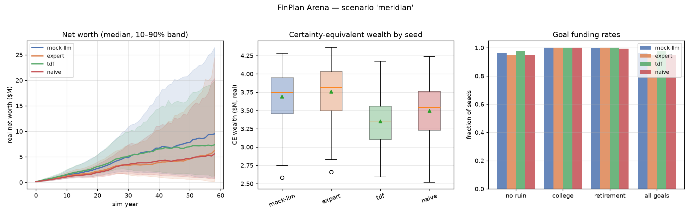

# Example comparison report — `meridian`, 300 paired seeds

End-to-end example produced entirely by the harness (no network): a
deterministic **mock LLM** (a believable mid-quality planner that runs
through the full LLM plumbing — JSON emission, schema validation, retry
machinery) against the three rule-based baselines on the default
**Meridian family** scenario, 300 shared Monte Carlo seeds, block-bootstrap
returns, 30 active decision years + passive drawdown to age 95.

Reproduce with:

```bash
for agent in expert tdf naive mock-llm; do
  finplan run --scenario meridian --agent $agent --seeds 300 --workers 8 \
              --log-detail summary --out runs/meridian_$agent
done
finplan compare runs/meridian_mock-llm runs/meridian_expert \
                runs/meridian_tdf runs/meridian_naive \
                --reference expert --charts comparison_charts.png \
                --json-out comparison.json
finplan report runs/meridian_mock-llm --out mock_llm_report.md
```

Every number regenerates bit-identically (the engine is deterministic given
scenario + agent + seed; this bundle's mock-llm run was regenerated from
scratch mid-build and matched to the float).

## Files

| file | what it is |
|---|---|
| `comparison_table.txt` | the paired-stats table below, as emitted by `finplan compare` |
| `comparison.json` | same payload, machine-readable |
| `comparison_charts.png` | wealth fan chart · CE distributions · goal-funding rates |
| `mock_llm_report.md` | single-agent deep dive: median/best trajectories, worst-seed post-mortems, violation digest |
| `summaries/*.json` | per-seed metrics for each agent (inputs to the stats) |

## Results

```
metric                                      mock-llm            expert               tdf             naive
----------------------------------------------------------------------------------------------------------
seeds                                            300               300               300               300
median CE wealth (real $)                  3,743,328         3,817,781         3,355,877         3,538,301
p10 CE wealth (real $)                     3,225,063         3,237,883         2,925,705         3,003,548
median CE annual (real $/yr)                 134,617           137,294           120,683           127,243
median terminal wealth (real $)            9,494,605         6,222,126         7,357,065         5,570,820
P(ruin before 95)                               4.0%              5.0%              2.3%              5.0%
P(all goals met)                               96.0%             95.0%             97.7%             95.0%
P(college goal met)                           100.0%            100.0%            100.0%            100.0%
P(retirement goal met)                         99.7%            100.0%            100.0%             99.3%
mean lifetime taxes (real $)               3,998,424         2,390,650         3,930,389         2,924,800
mean lifetime penalties (real $)                 869                75               133                 0
mean violations / trial                         1.00              0.00              0.00              0.00
mean decision churn                            0.003             0.008             0.007             0.000

Paired differences vs 'expert' on ce_wealth (positive = better than expert; bootstrap 95% CI):
  mock-llm     mean diff        -65,633   CI [-74,795, -56,849]    win rate 18.7%   (SIGNIFICANT, n=300)
  tdf          mean diff       -406,694   CI [-420,063, -393,198]  win rate  0.0%   (SIGNIFICANT, n=300)
  naive        mean diff       -261,354   CI [-271,180, -252,012]  win rate  0.0%   (SIGNIFICANT, n=300)
```



## Reading the results

* **The ordering is expert > mock-llm > naive > tdf on CE wealth, and every
  gap is significant** (bootstrap CI excludes zero on 300 paired seeds).
  Differences this size would be hard to resolve unpaired: seed-to-seed CE
  spans millions while the mock-llm–expert gap is ~$66k.
* **Why the mock LLM loses to the expert** — visible directly in the trial
  logs: it claims Social Security at 65 (expert bridges to 70 for the
  higher earner), never Roth-converts (its median seed shows a forced
  **$3.1M RMD** and a **$1.24M tax bill** at age 96 — the RMD tsunami the
  expert's 12%-bracket conversions defuse), misses the backdoor when the
  front door phases out (`roth_magi_phaseout` violation in exactly the year
  its crude MAGI estimate goes stale — 300 occurrences across 300 trials),
  and parks its retirement cash flow in T-bills. Its ~$1.6M extra lifetime
  taxes and ~$3.3M higher terminal wealth are the same story: money left on
  the table and money left unconsumed.
* **Why naive beats tdf here despite worse mechanics** (more taxes, no
  match, SS at 62): tdf's flat 15% savings rate over-saves this affluent
  household, so it under-consumes for 27 working years. CRRA-3 utility
  prices that austerity higher than naive's tax sloppiness — and tdf shows
  it in the goal columns instead, with the lowest ruin rate (2.3%). The
  metric is doing its job: consumption timing, tail safety, and tax
  efficiency are all visible, in different columns.
* **Ruin seeds overlap heavily across agents** (9 of the worst paths are
  shared by expert, naive, and mock-llm) — they are hostile draws
  (1970s-style inflation sequences where CPI-indexed expenses outrun 3%
  nominal salary growth), not agent blunders; the deep-dive report's
  post-mortems make the distinction inspectable per seed.
